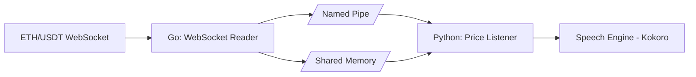

# 📈 ETH Price Alert with TTS

Real-time **Ethereum price alerts** using:

- **Go** → streams live ETH/USDT trades from Binance WebSocket, writes price to shared memory, and signals Python via a named pipe.  
- **Python** → reads from shared memory, blocks on pipe notifications, and generates **speech alerts** with [Kokoro TTS](https://github.com/hexgrad/kokoro).  

Designed for **low-latency**, **CPU-efficient**, and **instant voice alerts** when ETH crosses predefined price thresholds.

---

## ✨ Features

- 🔌 **Zero polling** — Python blocks on pipe notifications, wakes up only when Go signals.
- 📢 **Named Pipe** signaling from Go → Python  
- ⚡ **Ultra-low latency** — Binance WebSocket → SHM → speech in milliseconds.  
- 🗣️ **Kokoro TTS** with preloaded lead-ins for low-latency alerts
  - Speaks only **integer prices** (e.g., “up to 2600”)  
  - Uses pre-cached lead-in phrases for faster response.  
- 📦 **Shared memory (mmap)** → efficient data handoff (no JSON parsing in Python).  
- 🔄 **Exponential backoff reconnect** → Go automatically reconnects to Binance if WebSocket closes.  
- ✅ **Debounce & fade-out** → avoids overlapping or spammy alerts.  
- 🐧 **Linux-first design** — uses `/dev/shm` and named pipes.  

---

## 🖼️ Architecture


# ▶️ Usage
1. Start Go writer (Binance → SHM + Pipe)
```
go run binance_shm_writer.go
```
3. Start Python reader (Pipe → TTS)
```
python3 tts_shm_reader.py
```

